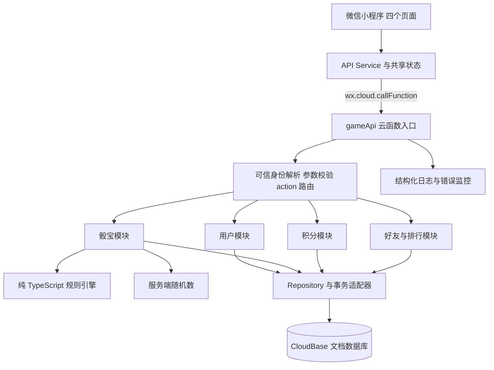

# 微信骰宝小程序：第一版技术栈与架构方案

更新时间：2026-09-20

文档状态：第一版技术决策，可作为原型设计与后续开发依据。本文只定义方案，不代表已经创建代码、开通云资源或完成平台审核。

## 1. 结论

第一版采用 **微信原生小程序 + TypeScript + TDesign Miniprogram + 腾讯云开发 CloudBase**。

前端使用微信原生 `Page / Component` 框架，后端使用 Node.js 云函数，数据库使用 CloudBase 传统模式文档数据库。整体采用 **单仓库、模块化单体、服务端权威结算** 架构。

适用前提：先服务微信端，四个主要页面，单人即时开奖，好友只参与排行。第一版不引入多人房间、统一开奖、交易市场或复杂管理后台。

这套选择优先解决三个问题：尽快做出完整可玩的版本；保证虚拟积分不会因并发或重试被错误修改；降低早期服务器运维成本。

### 1.1 微信小程序与小游戏的边界

本方案按用户指定的微信小程序形态设计，使用 WXML / WXSS 页面。**普通小程序与微信小游戏是不同运行形态，原生小程序页面不能直接当作小游戏页面发布。**

公开发布前，需要结合实际玩法、主体和申报类目确认平台接入路径。纯虚拟积分并不等于平台一定允许该玩法，也不能据此保证审核通过。本次未能直接读取微信平台相关规范全文，因此不在本文对类目和准入作确定性判断。

如果平台要求走微信小游戏形态，应在正式制作页面前调整前端渲染方案；后端接口、积分系统、数据模型和纯 TypeScript 规则层继续复用。后续检查入口：[微信小程序文档](https://developers.weixin.qq.com/miniprogram/dev/framework/)、[微信小游戏文档](https://developers.weixin.qq.com/minigame/dev/guide/)。这是一项上线前置核验，不影响先完成技术方案与玩法原型。

## 2. 第一版范围

| 页面 | 必做功能 | 实现边界 |
| --- | --- | --- |
| 骰宝首页 | 玩法区域、筹码选择、确认投入、摇骰动画、结果弹层、最近记录 | 三颗骰子；单人独立即时开奖 |
| 钱包 | 虚拟积分余额、新用户积分、每日领取、收支明细 | 积分仅供游戏，不接支付、充值、提现、兑换或转账 |
| 好友排行 | 发起邀请、接受邀请、好友列表、排行、我的名次 | 建立游戏内好友关系；不依赖读取微信通讯录 |
| 我的 | 默认头像和昵称、游戏统计、规则说明、音效设置 | 第一版使用预设头像和系统昵称，减少资料授权与内容管理成本 |

第一版不做：多人对战、共享奖池、统一倒计时开奖、聊天、积分赠送、实物奖励、广告变现、自动连续投入、自定义头像上传、独立运营后台。

### 2.1 玩法语义

以下为本项目拟定规则，目的是固定产品语义；不宣称与澳门某一家场所的全部规则或赔率一致。

| 玩法 | 第一版定义 |
| --- | --- |
| 小 | 三骰总和为 4～10，任意豹子时不命中 |
| 大 | 三骰总和为 11～17，任意豹子时不命中 |
| 任意豹子 | 三颗骰子数字相同 |
| 指定豹子 | 指定的 1～6 某个数字出现三次 |
| 点数 | 三骰总和恰好为选定值；第一版提供 4～17，豹子也按实际总和判定 |
| 出现某点 | 指定 1～6 中某个数字；按出现 1、2、3 次分别结算 |

同一局允许选择多个玩法，相同选项的积分投入合并；不同选项独立计算，最后合并入账。随机结果与所选玩法、积分、输赢历史无关。

赔率以服务端版本化配置为准，页面读取同一份规则。方案阶段仅固定计量口径：`profitMultiplier` 表示净赢倍数，命中返还为 `stake × (1 + profitMultiplier)`，未命中返还为 0。例如净赢倍数为 1、投入 10，命中返还 20。

各玩法具体倍数属于产品配置，进入规则实现阶段统一制定并检查；本文不把未确认的数值当作既定需求。测试可先使用明确标注的测试规则表，正式环境不能使用缺项规则。

### 2.2 默认产品参数

以下作为原型默认值，均集中配置：

- 新用户一次性获得 1,000 积分；每天主动领取 500 积分，以服务端北京时间自然日计算。
- 筹码为 10、50、100；投入必须是 10 的正整数倍。
- 每局总投入上限为 500，且不能超过当前余额。
- 排行按当前积分余额降序，相同余额按内部用户 ID 升序；只展示自己和已接受邀请的好友。
- 第一版每人最多 50 位好友，排行返回最多 51 人，避免一开始引入全站榜单和异步排名系统。
- 积分只使用安全整数；余额上限暂定 1,000,000,000。结算可能越界时整笔拒绝，不截断奖励。

## 3. 技术栈与框架

| 层次 | 选型 | 使用方式与理由 |
| --- | --- | --- |
| 前端框架 | 微信原生小程序 `Page / Component` | 直接使用页面、组件和生命周期，四页规模无需额外跨端编译层 |
| 前端语言 | TypeScript + WXML + WXSS | 业务类型明确；微信提供官方 API 类型声明包 |
| 基础组件 | `tdesign-miniprogram` | 按需使用按钮、弹层、提示、列表等；骰桌与筹码自定义组件实现 |
| 页面状态 | 页面局部状态 + 轻量共享 Store | `setData` 更新界面；共享用户、余额、规则和设置，不引入复杂状态框架 |
| 动画 | WXSS 动画 + 骰子静态资源 | 先实现轻量摇骰效果，最终点数绑定服务端结果 |
| 后端计算 | CloudBase 普通云函数 | 小程序通过 `wx.cloud.callFunction` 调用，不自建 HTTP 网关 |
| 后端语言 | TypeScript → Node.js JavaScript | 与前端共用契约类型，服务端保留独立校验 |
| Node.js 基线 | 24 LTS，部署时核对目标环境支持 | 固定目标运行时；构建产物与运行时一致，不依赖云端默认版本 |
| 微信身份适配 | `wx-server-sdk` | 从平台可信调用上下文解析微信身份，不接受客户端指定身份 |
| 数据库访问 | `@cloudbase/node-sdk` | 封装传统模式文档数据库访问和服务端事务，与微信身份适配分层 |
| 数据库 | CloudBase 传统模式文档数据库 | 小规模业务无需另维护 MySQL/PostgreSQL；核心写入使用事务 |
| 请求校验 | 服务端显式校验函数 + TypeScript DTO | 当前输入结构较少，集中实现枚举、范围、整数、长度与字段校验 |
| 随机数 | Node.js `crypto.randomInt(1, 7)` | 服务端独立生成三次，无客户端参与开奖 |
| 构建与包管理 | npm workspaces + TypeScript + esbuild | 单仓库管理；后端和共享包构建为独立可部署产物 |
| 检查与测试 | `tsc --noEmit`、ESLint、Node.js 内置测试运行器 | 优先验证规则、事务、防重和授权；真机验证交互 |
| 运维 | 云开发日志、错误监控、用量告警 | 第一版不自建监控集群 |

官方依据：微信维护 [TypeScript API 类型库](https://github.com/wechat-miniprogram/api-typings)；腾讯维护 [TDesign 小程序组件库](https://github.com/Tencent/tdesign-miniprogram)；CloudBase 提供 [普通云函数](https://docs.cloudbase.net/cloud-function/introduce.html) 和 [运行时支持列表](https://docs.cloudbase.net/cloud-function/runtime-support)。实际包版本在初始化时核对兼容性并写入锁文件，本文不把搜索结果中的版本当作安装锁定版本。

### 3.1 为什么不选择更重的组合

- **uni-app / Taro**：当前没有 H5、App 或多个小程序平台的需求，暂不承担跨端适配成本；如果后续明确多端目标，再重新评估。
- **NestJS + PostgreSQL + Redis**：可以实现，但当前规模不需要额外服务器、连接池、缓存和部署流水线。保留服务层与仓储接口，未来可迁移。
- **游戏引擎**：在普通小程序原型形态下，四页界面和简单骰子动画无需引入引擎。如果转为微信小游戏，前端选型需重新评估。
- **纯前端积分**：仅可用于离线演示，不满足真实用户的持久化钱包和可信好友排行需求。

## 4. 总体架构



第一版只部署一个对外业务云函数 `gameApi`，通过白名单 `action` 分发。单一部署单元内部按职责分模块，避免“每个按钮一个云函数”导致共享代码和结算逻辑散落。

### 4.1 前端职责

- 页面：界面渲染、交互、生命周期、空状态和错误状态。
- 组件：骰子、玩法格、筹码、余额、开奖记录等可复用视觉单元。
- API Service：统一封装云函数调用、错误映射、查询重试和请求 ID。
- Store：保存会话快照，广播余额刷新；以后端余额及其 `version` 为准，忽略旧版本响应，防止乱序回退。
- 本地存储：只保存偏好、规则缓存、待确认的请求 ID 和请求体；不作为钱包事实来源。
- 接口超时后进入“确认结果中”，通过原请求 ID 查询或重试，不能生成新请求 ID 当作同一次操作重发。

### 4.2 后端分层

1. `entry / middleware`：可信上下文身份、输入校验、请求追踪、错误转换。
2. `modules/*/service`：组织业务步骤和事务，承担权限校验。
3. `domain`：骰子结果判定、返还计算与规则版本检查，不依赖微信 SDK 或数据库。
4. `repositories`：集合读写、索引查询、事务操作，隐藏云厂商细节。
5. `adapters`：微信身份、CloudBase 数据库、随机数、时钟和日志。

共享契约只提供类型和协议；类型不会替代运行时校验。客户端不包含服务端随机数实现、私有字段或管理能力。

## 5. 身份与权限

- 小程序通过云函数调用链建立身份，服务端只信任平台上下文中的微信标识；不能信任 `payload.openid`、`payload.userId` 等字段。
- 服务端将微信标识映射为内部 `userId`；首次建档和赠送积分在同一个事务内完成，使用确定性用户主键防止并发重复建档。
- 客户端只拿内部公开标识和必要资料；好友排行不返回微信 OpenID、他人钱包流水或邀请令牌。
- 所有业务集合默认禁止小程序端直接读写；由云函数校验归属和好友关系后返回裁剪的数据。云函数拥有数据访问能力，不等于调用者拥有数据访问权限。
- 默认头像昵称由系统生成，第一版不要求手机号或通讯录授权。

CloudBase 支持小程序通过 SDK 调用云函数；身份接入需在目标环境中验证平台注入上下文，不能把普通请求字段当作认证结果。参考：[调用普通云函数](https://docs.cloudbase.net/cloud-function/how-use)、[小程序访问云数据库及权限](https://docs.cloudbase.net/recipes/add-database-wechat-miniprogram)。

## 6. 核心流程：一局只产生一次账务结果

### 6.1 正常开奖

1. 页面获取完整规则及 `ruleVersion`，选择玩法和投入积分。
2. 点击确认时生成 `requestId`，冻结本次请求体并本地保存，禁用重复提交按钮。
3. 调用 `game.play`，只提交请求 ID、规则版本、玩法和投入数值。
4. 服务端校验身份、整数、白名单、条数、总投入和规则版本，规范化投注项并计算 `requestHash`。
5. 以 `userId + requestId` 推导确定性 `roundId`，先检查已有结果；同 ID 不同请求体返回冲突，同 ID 同请求返回已存结果。
6. 读取不可变规则版本，在一次函数执行中生成三颗随机骰子并计算各项返还；事务自动重试时复用这次执行已生成的结果。
7. 开启数据库事务，先重新检查局记录，再读钱包，检查余额、版本、限频和整数上限。
8. 在同一事务中更新钱包、写入一条已结算局记录、写入投入与返还流水。局记录保存权威响应快照。
9. 事务提交成功后才返回结果；前端播放/结束动画，刷新余额和记录。

**每一局只有“整体提交成功”或“没有账务变动”两种持久化结果。** 第一版不建立“先扣积分，几秒后另一任务开奖”的分布式流程。

对于服务端随机数，使用 Node.js 官方提供的 [`crypto.randomInt`](https://nodejs.org/download/release/v22.15.0/docs/api/crypto.html)，范围下界包含、上界不包含，因此 `randomInt(1, 7)` 得到 1～6。禁止根据玩家余额或历史输赢调整结果。

### 6.2 积分结算口径

```text
stakeTotal = 所有玩法投入之和
payoutTotal = 所有玩法返还之和（命中返还包含该项本金）
netChange = payoutTotal - stakeTotal
balanceAfter = balanceBefore + netChange
```

示例：余额 1,000，大投入 100，某指定数字投入 50；假设按测试规则两项分别返还 200 和 100，则总投入 150、总返还 300、净增加 150、余额为 1,150。

流水写为 `BET_DEBIT = -150` 和 `BET_PAYOUT = +300`，不能再把本金重复退回。完全未命中时不写零金额返还流水。两条流水顺序固定，保存连续的账务序号与变动后余额。

### 6.3 重试与并发

| 情况 | 处理 |
| --- | --- |
| 重复点击、同 ID 并发调用 | 事务内依靠确定性局主键和钱包写冲突保证只有一次提交；其他请求读取已提交结果 |
| 同 ID、更改投入内容 | 返回 `IDEMPOTENCY_CONFLICT`，不能覆盖旧记录 |
| 响应丢失但事务已提交 | `game.getRound` 查到原结果，不能重新生成已完成局的骰子 |
| 同请求在不同函数实例中重试 | 可能分别生成候选结果，但只有成功提交的一份成为权威结果，其他候选丢弃 |
| 查询暂时未发现结果 | 不视为永久失败；可以用原 ID 和原请求体再次调用，继续通过事务防重 |
| 多设备同时投入 | 钱包事务串行化有效变动；失败方重读余额，禁止余额变负 |
| 事务冲突 | 有上限地重试；耗尽后返回可重试错误，客户端保留原请求 ID |
| 老规则页面提交 | 已完成请求优先返回历史结果；新的操作返回 `RULE_VERSION_EXPIRED` 并刷新规则 |
| 客户端切后台或关闭 | 已提交结果不受动画影响；重进页面查询待确认局并刷新钱包 |

规则版本在接受新请求时选定后保持不可变；规则切换不能修改在途请求使用的旧规则。旧请求结果查询不受当前规则失效影响。

### 6.4 每日积分

以 `userId + Asia/Shanghai 日期` 生成确定性领取主键，领取标记、钱包更新、领取流水在同一事务提交。时间来自服务端；重复领取返回原结果。新用户赠送采用同样的防重原则。

### 6.5 事务能力约束

CloudBase 传统数据库事务在服务端执行，事务内按文档 ID 操作，不能把普通条件查询直接搬入事务。本方案使用确定性 ID 定位局、钱包、领取标记和流水；事务内不请求外部接口、不等待动画、不批量计算排行。具体限制以 [CloudBase 事务文档](https://docs.cloudbase.net/database/transaction) 为准。

开发第一步应验证所选 SDK 与目标环境支持跨集合原子提交、冲突处理和回滚，再开展完整页面开发；该验证属于后续实施，本次只编写文档。

## 7. 数据模型

数据库集合按业务职责拆分；时间统一存服务端 UTC 时间戳，展示和每日领取边界使用北京时间。

| 集合 | 主键或防重方式 | 核心字段 |
| --- | --- | --- |
| `users` | 根据应用身份与微信标识生成稳定内部 ID | 私有身份映射、系统昵称、预设头像、状态、创建时间 |
| `wallets` | `_id = userId` | `balance`、`version`、`ledgerSeq`、总局数、命中局数、累计投入、累计返还、`lastPlayAt` |
| `rounds` | `hash(userId, requestId)` | 用户、请求摘要、规则版本、规范化选项、骰子、总和、豹子标记、各项返还、结算快照、时间 |
| `wallet_ledgers` | 根据业务主键和流水类型确定 | 用户、类型、`delta`、`balanceAfter`、`seq`、关联局或领取 ID、时间 |
| `daily_claims` | `hash(userId, localDate)` | 领取日期、发放积分、领取结果快照、时间 |
| `friend_invites` | 随机令牌的哈希 | 邀请人、接收人、状态、过期时间、创建时间 |
| `friendships` | `hash(minUserId, maxUserId)` | 两端用户 ID、建立时间 |
| `friend_limits` | `_id = userId` | 好友数量，用于接受邀请事务内检查双方上限 |
| `game_rules` | 不可变 `ruleVersion` | 玩法、净赢倍数表、积分上下限、筹码、发布时间 |
| `app_config` | 固定配置文档 ID | 生效规则版本、新局开关、每日积分参数 |

初始化时为用户创建钱包及好友数量文档。命中局数定义为“至少一项返还大于零的局数”，不等于净盈利局数；需要净盈利统计时独立计数。

### 7.1 索引

- `rounds`：`userId + createdAt DESC + _id DESC`，用于个人历史游标分页。
- `wallet_ledgers`：`userId + seq DESC`，用于连续账务分页；`userId + seq` 设唯一约束（若环境支持），并始终通过钱包序号事务分配防重。
- `friendships`：分别建立两端用户字段索引；查自己参与的两类关系后合并去重。
- `friend_invites`：按令牌哈希主键定位；必要时增加邀请人和创建时间索引以限制邀请生成频率。
- `daily_claims`、`wallets`、`game_rules`：优先主键访问。

查询使用服务端固定排序与游标；客户端不能传任意数据库条件。所有 `hash(...)` 使用固定编码的元组生成，避免简单字符串拼接造成歧义。

### 7.2 一致性约束

- 每笔积分变化都对应不可变流水，不允许“只改余额不记账”。
- 钱包余额等于该用户全部有效流水 `delta` 之和；初始积分也必须记流水。
- 每个请求最多对应一局；每局投入及返还与流水严格对应。
- 钱包统计在结算事务中同步更新；排行榜读取钱包，不维护异步余额副本。
- 不修改历史规则和已结算记录；错误修复使用可追踪的补偿流水。
- 第一版不清理局记录和防重标记。未来做归档时必须保留可查询结果或防重摘要，避免历史 ID 被再次执行。

## 8. API 契约

统一通过 `gameApi` 调用，以下 `action` 是逻辑接口名，不是公开 HTTP 路径。

```ts
type ApiRequest<T> = {
  action: string;
  requestId: string;
  payload: T;
};

type ApiResponse<T> =
  | { ok: true; data: T; traceId: string; serverTime: number }
  | {
      ok: false;
      error: { code: string; message: string; retryable: boolean };
      traceId: string;
      serverTime: number;
    };

type Bet = {
  type: 'BIG' | 'SMALL' | 'ANY_TRIPLE' | 'EXACT_TRIPLE' | 'SUM' | 'SINGLE';
  value?: number;
  stake: number;
};

type PlayPayload = { ruleVersion: string; bets: Bet[] };
```

这是契约草案；实现时将 `Bet` 收紧为判别联合，规定哪些玩法必须有 `value`、哪些不允许。服务端检查合法选项、每项投入、合并后条数、总投入及字段长度。客户端不得提交中奖标记、骰子、返还值或余额。

| action | 作用 | 关键约束 |
| --- | --- | --- |
| `user.bootstrap` | 初始化用户并返回个人资料、钱包和当前规则版本 | 一次性建档与新用户赠送防重 |
| `game.getRules` | 获取当前完整规则 | 输出可公开配置，版本不可变 |
| `game.play` | 提交并原子结算一局 | 强制幂等；返回局 ID、骰子、逐项返还、净变动、钱包版本 |
| `game.getRound` | 通过原请求 ID 获取结果 | 仅能查自己的局 |
| `game.listRounds` | 获取个人历史 | 游标分页，每页默认 20 条，最大 50 条 |
| `wallet.get` | 获取当前积分和版本 | 服务端身份决定查询对象 |
| `wallet.listLedgers` | 获取收支流水 | 按序号游标分页，只能查本人 |
| `wallet.claimDaily` | 领取每日积分 | 按用户及服务端日期防重 |
| `friend.createInvite` | 创建短期有效的一次性邀请 | 返回分享路径或邀请链接参数；限制生成频率 |
| `friend.acceptInvite` | 接受邀请并建立双向好友关系 | 显式接受，检查有效期、自邀请、重复关系和双方人数上限 |
| `friend.remove` | 解除好友关系 | 双方人数在同一事务减一，重复调用无副作用 |
| `ranking.listFriends` | 获取好友榜及自己的名次 | 只查询当前好友集合，返回公开资料、积分与 `asOf` |
| `user.getStats` | 获取个人统计 | 使用钱包中的同步统计 |

通用错误包括：`UNAUTHENTICATED`、`INVALID_ARGUMENT`、`INSUFFICIENT_POINTS`、`RULE_VERSION_EXPIRED`、`IDEMPOTENCY_CONFLICT`、`RATE_LIMITED`、`INVITE_EXPIRED`、`NOT_FOUND`、`INTERNAL_ERROR`。

客户端对明确的参数错误不自动重试；对超时或不确定结果先查询原操作。日志通过 `traceId` 定位，返回消息不包含堆栈或内部身份数据。

## 9. 好友与排行的具体实现

“好友”定义为用户在本游戏内通过邀请建立的关系，不假设可直接获取微信好友名单。

1. 用户主动创建邀请，服务端生成不可预测令牌，默认有效期 24 小时，只存令牌哈希。
2. 用户自行分享卡片；接收者打开后看到邀请信息并主动点击接受，不在打开时自动绑定。
3. 服务端事务检查邀请与双方好友数量，写入唯一关系、增加双方数量、将邀请标为已接受。
4. 已接受邀请仅对同一接收者重试返回成功，其他用户不可重复使用；分享成功回调不作为已建立关系的依据。
5. 排行查询双方关系索引得到好友 ID，加入自己，分批读取公开资料及钱包余额，再在服务端排序。

第一版最多读取 51 人，不需要 Redis 有序集合或定时重算榜单。列表返回的是查询时点附近的余额快照，不承诺多个用户余额来自同一个数据库快照。页面进入或下拉时刷新，短暂排名变化可以接受。

若后续支持上千好友、全站榜、赛季榜或高频刷新，再增加榜单快照或专用索引；它们不进入第一版依赖。

## 10. 建议工程目录

本次仅创建 `_mock` 下的方案文档。以下是后续开发时的建议结构：

```text
game/
├─ _mock/
│  └─ 微信骰宝小程序技术方案.md
├─ apps/
│  └─ miniprogram/
│     ├─ pages/
│     │  ├─ game/
│     │  ├─ wallet/
│     │  ├─ ranking/
│     │  └─ profile/
│     ├─ components/
│     ├─ services/
│     ├─ stores/
│     ├─ assets/
│     └─ app.ts / app.json / app.wxss
├─ services/
│  └─ game-api/
│     ├─ src/
│     │  ├─ entry.ts
│     │  ├─ middleware/
│     │  ├─ modules/
│     │  │  ├─ user/
│     │  │  ├─ game/
│     │  │  ├─ wallet/
│     │  │  ├─ friend/
│     │  │  └─ ranking/
│     │  ├─ repositories/
│     │  └─ adapters/
│     └─ tests/
├─ packages/
│  ├─ contracts/             # 前后端共享 DTO 与错误码
│  └─ domain/                # 纯规则与计算，独立测试
├─ scripts/                  # 本地构建、检查、索引说明
├─ dist/                     # 自动生成的微信工程及云函数产物
├─ package.json
├─ package-lock.json
└─ project.config.json
```

前端构建应把 `contracts` 的运行时代码（如确有需要）打包到小程序根目录内；不能让微信端依赖根目录之外的源码或 npm workspace 符号链接。类型引用在编译时消除。

云函数构建为独立 `dist/cloudfunctions/gameApi`，包含可执行 JavaScript、入口和独立依赖声明。SDK 及其生产依赖随部署产物正确解析，不假定云端有工作区其他目录。TDesign 组件采用开发者工具 npm 构建流程，最终路径纳入前端产物。

## 11. 环境与运行边界

- 开发与正式环境隔离，使用不同 CloudBase 环境和数据；不能用正式钱包测试。
- AppID、环境 ID 在各环境配置中绑定；密钥不进入前端、源码或日志。
- 第一阶段就验证微信身份上下文、Node.js 运行时、SDK 事务兼容性和小程序 npm 组件打包。
- 第一版可使用云开发控制台查看记录和日志；不提供客户端改余额或指定开奖结果的管理接口。
- 规则更新使用不可变版本，新局读取生效版本；暂停开关只阻止新局，不阻止查历史结果。
- 服务端按用户限制新局频率，建议两秒一局；防重查询优先，避免把恢复结果请求误判成频繁开局。邀请创建另设服务端配额。
- 单实例内存锁无法覆盖云函数多实例，不能用于账务防重或跨实例限流。
- 记录 action、traceId、耗时、错误码和脱敏用户标识；不记录完整邀请令牌、敏感身份或密钥。
- 对失败率、结算耗时、数据库冲突、调用量和存储量设置监控；具体资源套餐与成本在开通前根据官方计费页核算，本文不承诺永久免费或固定月费。

## 12. 测试与验收

以下为后续实现验收项，本次未运行应用测试。

### 12.1 规则测试

- 枚举三颗骰子的全部 216 种有序组合，覆盖大小边界、六种豹子、总点数、单数字出现次数。
- 独立断言：小和大各命中 105 种组合，任意豹子命中 6 种，每种指定豹子命中 1 种。
- 对某个固定数字，出现 0、1、2、3 次的组合数应分别为 125、75、15、1。
- 根据批准后的规则表验证每项返还；所有金额均为安全整数，负数、小数、无穷值和超限输入被拒绝。

### 12.2 账务与授权测试

- 相同请求并发提交多次，只出现一局和一组流水，余额只变动一次。
- 同 ID 不同请求体返回冲突，不改变旧结果。
- 多个不同请求并发消耗同一钱包，不产生负余额。
- 在事务写入中途注入错误，钱包、局和流水全部回滚。
- 模拟提交成功后响应丢失，恢复得到原骰子和余额快照。
- 并发首次登录和每日领取只发放一次积分，覆盖北京时间跨日边界。
- 伪造用户 ID、直接写数据库、查询他人记录、篡改骰子或返还均无效。
- 接受邀请并发重试不重复增加好友数量，过期与自邀请被拒绝。

### 12.3 界面与运行验收

- 四个页面可用，空列表、余额不足、网络失败、加载和查询中状态完整。
- iOS / Android 微信真机覆盖；验证底部安全区、字体、动画结束和后台恢复。
- 旧响应不会覆盖新版钱包；开奖结果来自服务端，动画不能触发额外结算。
- 好友榜只包含当前游戏好友与自己，并与刷新时的服务端余额一致。
- 新局、每日领取与好友建立均能通过 traceId 追踪，云开发环境与数据库权限配置明确。

## 13. 实施顺序

| 阶段 | 工作内容 | 完成标准 |
| --- | --- | --- |
| 1. 接入验证 | 确认小程序/小游戏路径；验证身份、构建和事务能力 | 技术接入可行，明确正式前端运行形态 |
| 2. 规则与契约 | 制定完整赔率表，固定接口、数据结构与规则版本 | 216 种结果的规则测试及结算示例通过 |
| 3. 账务闭环 | 建档、钱包、领取、开奖、历史与防重 | 并发、超时恢复、回滚和授权测试通过 |
| 4. 四页前端 | 骰桌、动画、钱包、我的和排行页面 | 完整单人体验可用，关键错误可恢复 |
| 5. 好友与联调 | 邀请、关系、排行，跨设备和真机验证 | 两个真实测试账号能建立关系并查看正确榜单 |
| 6. 发布准备 | 根据已确认平台路径处理账号、类目、环境与审核材料 | 具备可提交版本，发布动作另行执行 |

技术栈已按第一版范围选定。实施前还需完成两个具体事项：确认实际发布形态，以及制定完整赔率表；它们分别影响页面运行方式和规则配置，不需要推翻后端模块边界。

## 14. 参考资料与核验说明

资料核对日期为 2026-09-20。架构、默认参数、集合设计和接口命名是本项目设计决策，不是平台官方要求。

| 资料 | 用途与核验情况 |
| --- | --- |
| [微信官方 API 类型定义](https://github.com/wechat-miniprogram/api-typings) | 已获取官方仓库资料，支持 TypeScript 选型 |
| [TDesign Miniprogram](https://github.com/Tencent/tdesign-miniprogram) | 已获取官方仓库资料，支持小程序组件库选型 |
| [CloudBase 云函数概述](https://docs.cloudbase.net/cloud-function/introduce.html) | 已获取官方索引内容，核对托管计算能力 |
| [CloudBase 运行环境](https://docs.cloudbase.net/cloud-function/runtime-support) | 已获取官方文档内容，确认 Node.js 24 LTS 为可选基线；仍需核对目标环境 |
| [CloudBase 事务操作](https://docs.cloudbase.net/database/transaction) | 已获取官方索引正文中的事务能力和限制；直接打开曾超时 |
| [CloudBase 云函数调用](https://docs.cloudbase.net/cloud-function/how-use) | 已获取官方索引内容；具体微信身份适配仍需接入验证 |
| [CloudBase 小程序数据库访问](https://docs.cloudbase.net/recipes/add-database-wechat-miniprogram) | 已获取官方索引内容，参考数据库客户端权限边界 |
| [Node.js randomInt](https://nodejs.org/download/release/v22.15.0/docs/api/crypto.html) | 已获取官方 API 文档，参考均匀整数生成；页面版本不作为运行时选型 |
| [微信小程序文档](https://developers.weixin.qq.com/miniprogram/dev/framework/) | 直接访问受限，后续在微信开发者工具及平台核验 |
| [微信小游戏文档](https://developers.weixin.qq.com/minigame/dev/guide/) | 提供后续形态核验入口，本次未核验具体准入规则 |
